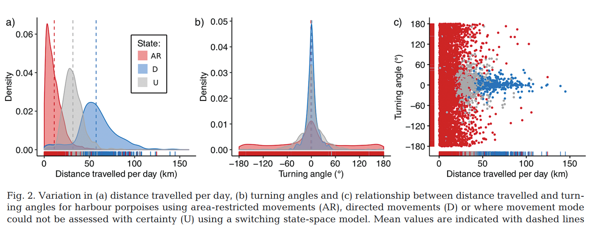
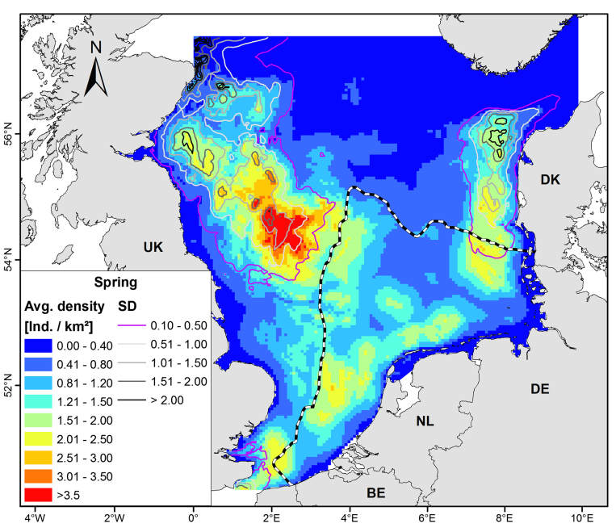
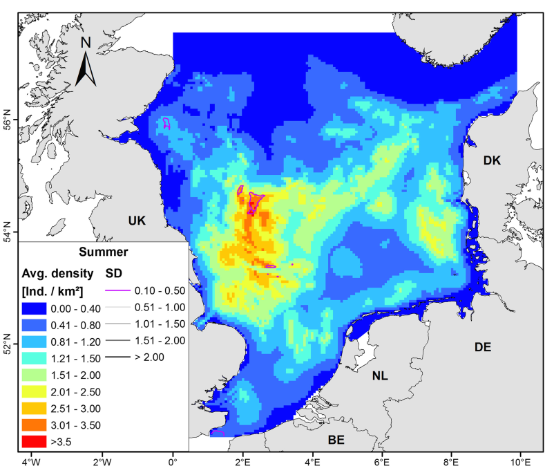
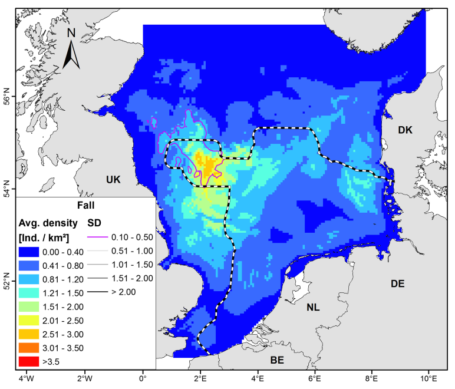

<!-- ```{=html} -->

<!-- <style type="text/css"> -->

<!-- body{ /* Normal  */ -->

<!--       font-size: 13px; -->

<!--   } -->

<!-- td {  /* Table  */ -->

<!--   font-size: 13px; -->

<!-- } -->

<!-- h1.title { -->

<!--   font-size: 24px; -->

<!--   color: Black; -->

<!-- } -->

<!-- h1 { /* Header 1 */ -->

<!--   font-size: 19px; -->

<!--   color: Black; -->

<!-- } -->

<!-- h2 { /* Header 2 */ -->

<!--     font-size: 15px; -->

<!--   color: Black; -->

<!-- } -->

<!-- h3 { /* Header 3 */ -->

<!--     font-size: 15px; -->

<!--   color: Black; -->

<!-- } -->

<!-- </style> -->

<!-- ``` -->

```{r setup, include=FALSE}
knitr::opts_chunk$set(echo = FALSE)
knitr::opts_chunk$set(warning = FALSE)

# libraries -----
library(here)
library(rnaturalearth)
library(tidyverse)
library(data.table)
library(sf)
library(raster)
library(lubridate)
# library(CircStats) # use for random draws of von Mises dist
library(circular) # use for random draws of von Mises dist
library(akima) # use for 2D linear interpolation
library(units)
library(mapview)
library(dismo)
library(osmdata)
library(stars)
library(gganimate)
library(proj4)
library(geosphere)
library (rgdal)

mapviewOptions(basemaps = c("CartoDB.Positron", 'Esri.WorldImagery', "OpenStreetMap"))

# NS_shp <- readOGR(here("data", "shp", "hp_prediction_Mar.shp")) #read in file
# ns_crs <- proj4string(NS_shp)
load(here::here('rdata','PP_positions.rdata'))

# base map -----
bg  <-  ne_countries(scale = "medium", continent = 'europe', returnclass = "sf")
bg <-
  st_transform(bg, crs = ns_crs)


p.dens.obs.spring <- ggplot() +
  geom_density2d_filled(data = positions[positions$month %in% 3:5,], aes(x = x, y = y)) +
  geom_sf(data = bg, fill = "white")  +
  xlab("") + ylab("") +
  coord_sf(xlim = c(3300000,4300000),
           ylim = c(3100000,4000000),
           default_crs  = ns_crs) +
  theme(legend.position = 'none')

p.dens.obs.summer <- ggplot() +
  geom_density2d_filled(data = positions[positions$month %in% 6:8,], aes(x = x, y = y)) +
  geom_sf(data = bg, fill = "white")  +
  xlab("") + ylab("") +
  coord_sf(xlim = c(3300000,4300000),
           ylim = c(3100000,4000000),
           default_crs  = ns_crs) +
  theme(legend.position = 'none')

p.dens.obs.fall <- ggplot() +
  geom_density2d_filled(data = positions[positions$month %in% 9:11,], aes(x = x, y = y)) +
  geom_sf(data = bg, fill = "white")  +
  xlab("") + ylab("") +
  coord_sf(xlim = c(3300000,4300000),
           ylim = c(3100000,4000000),
           default_crs  = ns_crs) +
  theme(legend.position = 'none')

``` 

# Overview

This short document provides some details on the porpoise movement model developed as an alternative to assess harbour porpoise exposure to wind farms in the North Sea.

Code and data to reproduce the analyses summarized in this document can be found in [**this repository**](https://github.com/adbpatagonia/PorpoiseMovement).


# Description of approach

Simplified the approach presented in @Joy2022.\
We simulate the movement of `n_agents` (here I am showing `n_agents = 100`) from March 1 to Nov 30, following the whale densities.\
In general terms, there are four steps of the approach:

-   Step 1: for each `agent`, choose an initial position in day t.

-   Step 2: given position in day t, propose candidate positions for day t+1 by using random draws of step length and turning angle

-   Step 3: calculate weight for each member of the forecast ensemble. Calculate the probability of each candidate position for each agent                      

-   Step 4: sample from the set of candidate positions, with the probability in  step 3.

## Whale density maps        

Density maps are from @gilles. Anita Gilles provided the shape files to Magda Chudzinska. They present seasonal density maps of harbour porpoise in the Noth Sea. Note that they cover spring (March-May), summer (Jun-Aug), fall (Sep-Nov). Therefore our movement model is restricted to March-November.

## Initial positions

To make sure we have porpoises distributed across the study area in the first step, I divided the space into 10 Voronoi blocks of equal area, calculated the expected proportional abundance in each of the blocks and allocated the agents to each of the blocks proportionally to the expected abundance. Within the blocks, I randomly chose the location of the agents, with the probability of the location proportional to the density of each pixel.         

<!-- `r mapviewOptions(basemaps = c('Esri.WorldImagery',"CartoDB.Positron",  "OpenStreetMap"))`     -->

```{r init pos, fig.width  = 10, fig.height = 6, echo=FALSE, message=FALSE, warning=FALSE}

mapview(this.density.blocks)

```

## Candidate positions


### Step length and turning angles

@nabe-nielsen2013 presented distributions of step lengths and turning angles at a 30 minute resolution. The original data was collected at a frequency of 6 seconds in @wilson2007. Without having the original dataset, I am not sure how to scale up the distribution presented at 30-minute interval to a daily time scale.

I did a quick search and found three tagging studies for harbour porpoise:

-   @read1997: tagged 9 porpoises in the Bay of Fundy and Gulf of Maine - data is available for 8 porpoises

-   @nielsen2013: tagged two female porpoises in West Greenland - data available for both

-   @sveegaard2011: tagged 64 harbour porpoises between 1997 and 2007, in order to determine the distribution in the North Sea, the western Baltic, and the waters in between. This dataset is used in several publications, but I could not find the data itself.

I harvested the data from the two papers that have available data, and compare below their distributions to the distribution of step length and turing angles presented in @stalder2020 (subset of 57 porpoises from the @sveegaard2011 study).

#### Stalder *et al.* 2020 data

Note that the data is data is:

-   at a daily time step\
-   discriminated by behaviour:
    -   Area-restricted movement
    -   Directed movement
    -   Uncertain

we will not discriminate by behaviour in this exercise, and therefore we only need one distribution that should resemble the mean daily movement



#### Harvested data

I created these distributions using data from @read1997 and @nielsen2013.

##### Step length

I extracted the `mean` and `var` of daily displacements from these data, and calculated the parameters of a gamma distribution as:

$$scale = Var(x)/E[x]$$ $$shape = E[x]^2/Var(x)$$ Using these parameters, I drew random step lengths from a gamma distribution.

```{r cpas, echo = FALSE, message = FALSE}
print(p.dists )
```

##### Turning Angle

I drew turning angles from a von Mises distribution. Given that the time step is daily, I allowed the agents to go in any direction (360°).

```{r angle, fig.width  = 8, fig.height = 4, echo=FALSE, message=FALSE, warning=FALSE}
p.angles
```

#### Comparison

At first sight, it seems like the distribution created from the harvested data resembles the distribution presented in @stalder2020. However, please note this passage from @nielsen2013: *"The average daily travel rates for the two harbour porpoises were 24 km (range 0.6 -- 103 km, SD=21.9) and 42 km (range 1.9 -- 118.7 km, SD=25.2), respectively, which are in the same range of harbour porpoises from Bay of Fundy (range 13.9 -- 58.5 km, SD=13.9), Canada (Read & Westgate 1997) but slightly higher NAMMCO SC/20/HP/08 Harbour porpoise working group November 20133 than found for the North Sea (20.4 kmd-1) and the Baltic Sea (15.4 km d-1) (Sveegaard et al. 2011)."*           

#### Conclusion     

I used the distribution from the harvested data from @read1997 and @nielsen2013, the "combined" category in the plot above.


### Spatial constraints

Candidate positions were considered valid only if:

-   interpolated density at the position was \> 0, and\
-   was within the North Sea - I am clipping the points using the seasonal density maps as masks     


## Calculate weight for each member of the forecast ensemble

For each candidate position, I obtained (using linear interpolation) the expected whale density at the point. The weight for each candidate position was then calculated as: $weight_{i,t} = density_{i,t} / density_{t-1}$, *i.e.* the weight of each candidate *i* at time *t* is the whale density at that position, divided by the whale density at the accepted position in day *t-1*.      
For each each candidate position, obtain the probability that it will be accepted, by weighting the $weight_{i,t}$ by the sum of weights:   
$p_{i,t} = weight_{i,t} / \sum_{i=1}^{n.candidates} weight_{i,t}$               


## Choose candidate

For each day and agent, draw one candidate position from the pool of candidate positions, with probability $p_{i,t}$.

## Practical considerations     

I started the agents on March 1, and allowed them to move until Nov 30 at daily steps. For the first day of each season, I changed the underlying density map that the agents followed.      


## Parameters            

n_agents: `r n_agents`               
n_candidates: `r ncandidates`                       

# Output

## Daily distances travelled       

this plot shows the distances travelled by the agents         

```{r diststravelled, echo = FALSE, message = FALSE}
print(p.dists.travelled )
```

## Seasonal comparisons of input densities and simulated agent densities        

### Spring



```{r springdens, echo = FALSE, message = FALSE}
print(p.dens.obs.spring )
```

### Summer



```{r summerdens, echo = FALSE, message = FALSE}
print(p.dens.obs.summer )
```

### Fall 



```{r falldens, echo = FALSE, message = FALSE}
print(p.dens.obs.fall )
```


# References
